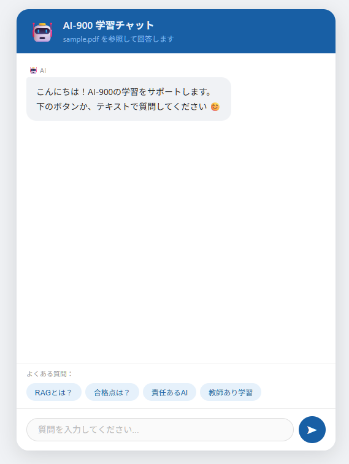
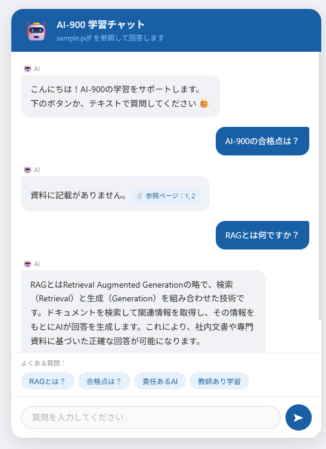

# AI-900 学習チャットボット

Azure AI サービスを活用したRAGチャットボットです。
PDF資料をアップロードすると、その内容を参照してAIが回答します。

## 📌 概要

AI-900（Microsoft Azure AI Fundamentals）の学習資料をPDFとして登録し、
自然言語で質問するとAIが資料を参照して回答するチャットボットです。

## 🛠 使用技術

| カテゴリ | 技術 |
|----------|------|
| バックエンド | Python / FastAPI |
| AI モデル | Azure OpenAI（gpt-4.1-mini） |
| ベクトル検索 | Azure AI Search |
| PDF解析 | Azure Document Intelligence |
| ファイル保存 | Azure Blob Storage |
| フロントエンド | HTML / CSS / JavaScript |

## 🏗 アーキテクチャ

PDFアップロード
↓
[Azure Blob Storage] → [Document Intelligence] → [Azure AI Search]
↓
[Azure OpenAI（RAG回答）]
↓
[FastAPI] → [Web UI]

## ✅ 機能

- PDFをAzure Blob Storageにアップロード
- Document IntelligenceでPDFを自動解析
- Azure AI Searchでベクトル検索
- Azure OpenAIがPDF内容を参照して回答
- 参照ページ番号を表示
- レスポンシブ対応のチャットUI

## 🚀 セットアップ手順

### 1. 必要なAzureサービス

- Azure OpenAI（gpt-4.1-mini / text-embedding-3-small）
- Azure AI Search（Free tier）
- Azure Document Intelligence（Free F0）
- Azure Blob Storage

### 2. リポジトリをクローン

```bash
git clone https://github.com/TakumiFuzawa/rag-chatbot.git
cd rag-chatbot
```

### 3. 仮想環境を作成

```bash
python -m venv .venv

# Mac/Linux
source .venv/bin/activate

# Windows
.venv\Scripts\activate
```

### 4. ライブラリをインストール

```bash
pip install -r requirements.txt
```

### 5. 環境変数を設定

```bash
cp .env.example .env
# .envにAzureのAPIキーを入力
```

### 6. PDFをインデックス登録

```bash
python src/indexer.py
```

### 7. アプリを起動

```bash
uvicorn app:app --reload
```

### 8. ブラウザで開く
http://127.0.0.1:8000

## 📁 フォルダ構成

```
rag-chatbot/
├── app.py              # FastAPI サーバー
├── index.html          # チャット画面
├── requirements.txt    # ライブラリ一覧
├── .env.example        # 環境変数テンプレート
├── src/
│   ├── config.py       # 設定読み込み
│   ├── indexer.py      # PDF→ベクトル化→AI Search保存
│   ├── chatbot.py      # CLI版チャットボット
│   └── create_pdf.py   # PDF作成ツール
└── data/
    └── sample.pdf      # サンプルPDF
```

## 🔑 環境変数

`.env.example`を参照してください。

## 📸 スクリーンショット

<div style="display: flex; gap: 16px;">
  
  
</div>

## 📝 学習目的

このプロジェクトはAzure AIサービスの学習を目的として作成しました。

- Azure OpenAI / AI Search / Document Intelligence の連携
- RAGアーキテクチャの実装
- FastAPI を使ったREST API開発
- AI-900資格取得に向けた実践的な学習
